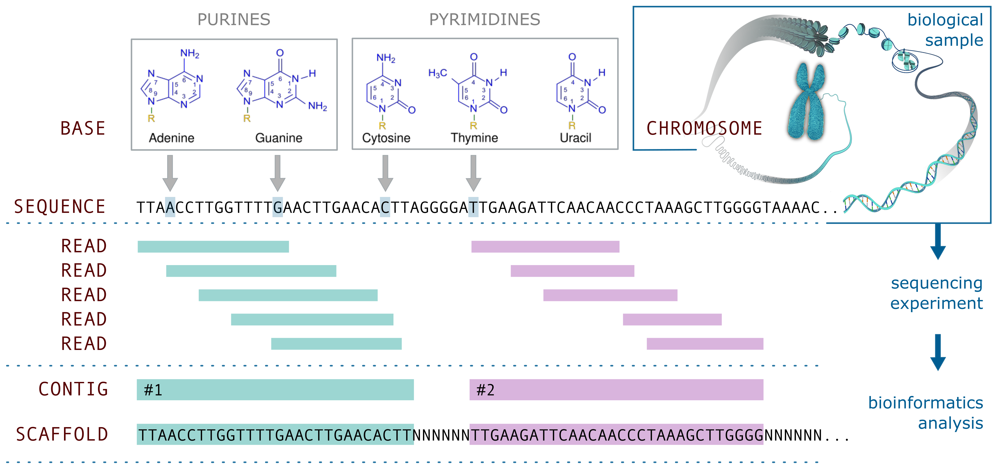
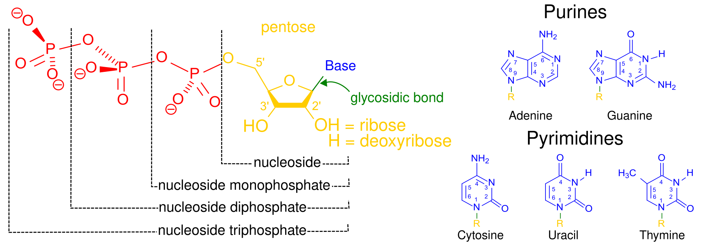

<div class="highlighted highlighted--basic"><div class="highlighted__body" markdown="1">
Familiarity with basic biological concepts (e.g., DNA, RNA, genes, genomes) is assumed.  
No prior experience with bioinformatics tools is required.
</div></div>

## Overview

This lesson introduces the fundamental types of nucleotide-based sequence elements in bioinformatics, tracing the path from raw sequencing reads to increasingly organized forms: contigs, scaffolds, and chromosomes. These terms are foundational to any bioinformatics task, from genome assembly and gene expression analysis to variant calling. By the end of this lesson, you’ll understand not just what these elements are, but how they connect, why they matter, and how to recognize them in real data.





## Core concepts

Biological samples are processed using experimental sequencing technologies that detect individual [bases](#base) and produce millions of short [nucleotide sequence](#nucleotide-sequence) fragments called reads. These [reads](#read) are recorded, along with per-base quality scores, in digital `FASTQ` files. Bioinformatics tools are then used to merge overlapping reads to reconstruct longer sequence fragments, known as [contigs](#contig). In the next step, contigs are ordered, oriented, and linked together across unresolved regions by stretches of unknown bases. Such larger genomic elements are called [scaffolds](#scaffold). When scaffolds are further anchored to known [chromosomal structures](#chromosome), they form the basis of a [genome assembly](#genome-assembly). Once organized in this way and further polished, the assembly serves as a reference genome and becomes a powerful resource for downstream analyses.




## Nucleotide sequence

A nucleotide sequence is a linear chain of nucleotides, represented by the letters `A`, `T`, `C`, and `G` (or `U` in RNA). 
Nucleotide sequences are the language of DNA and RNA, and they provide the basis for nearly all bioinformatics analyses. 

### FASTA format
Nucleotide sequences are typically stored and shared in a plain-text format called `FASTA`, 
which begins with a descriptor line starting with `>` followed by the sequence itself on one or more lines.

```markdown
>example_sequence
TTAACCTTGGTTTTGAACTTGAACACTTAGGGGATTGAAGATTCAACAACCCTAAAGCTTGGGGTAAAAC
```
FASTA files usually have extensions such as `.fa`, `.fasta`, or `.fna`.

## Base

A base is a single nucleotide: Adenine (`A`), Thymine (`T`), Cytosine (`C`), or Guanine (`G`). Uracil (`U`) is found in RNA in place of Thyamine. 
Bases are the fundamental building blocks of [nucleotide sequences](#nucleotide-sequence).  


[[image soure: Wikipedia](https://en.wikipedia.org/wiki/Nucleotide)]

Sequencing instruments assign a [quality score](#quality-score) to each (nucleotide) base, reflecting the probability that the base was correctly identified.


## Read

A read is a short fragment of nucleotide sequence produced by a sequencing machine. It is a string of [bases](#base) represented by their single-letter codes (`A`, `T`, `C`, and `G`).
Here is an example of a read that is 50 bases long:
```markdown
TTAACCTTGGTTTTGAACTTGAACACTTAGGGGATTGAAGATTCAACAAC
```

### Read type and length

<div class="usa-accordion " >

<div id="read-length" class="accordion_content"   markdown='1'>
- **short-read** sequencing platforms (like Illumina) typically produce reads between 50 and 300 base pairs, up to ~1,000 bp
- **long-read** technologies such as PacBio and Oxford Nanopore can generate reads that span thousands to even millions of bases

Long reads improve assembly continuity, while short reads offer higher accuracy and throughput for variant calling and expression analysis.
</div>


<div id="read-type" class="accordion_content"   markdown='1'>
- **single-end**, sequencing is performed from one end of the DNA fragment
- **paired-end**, both ends of the same fragment are sequenced, providing information about the distance and orientation between the paired reads

Paired-end reads provide additional positional information that improves mapping accuracy and helps resolve repetitive regions or structural features in the genome.
</div>
</div>

The differences in read type and length directly influence bioinformatics choices, 
including which algorithms and tools to use, how to design workflows, and what trade-offs to consider between accuracy, coverage, and computational resources. 
**Reads are the `raw data` from which longer structures are reconstructed.**


### FASTQ format

Sequencing reads are stored in the **FASTQ format**, which includes four lines for each read: 
(1) a read identifier, (2) the nucleotide sequence, (3) a separator line (+), and (4) a string of ASCII characters representing [per-base quality scores](#quality-score). 
FASTQ files typically use the `.fastq` or `.fq` file extension.

```markdown
@SRR4420293.1 HWI-ST1136:361:HS250:1:1101:1130:2234/1   #1 identifier line (read ID)
TTAACCTTGGTTTTGAACTTGAACACTTAGGGGATTGAAGATTCAACAAC      #2 READ SEQUENCE 
+                                                       #3 separator line
CCCFFFFFHHHHHJJJJJJJHIIJJFFFEDEEEEEEEDDDDDDDDEDD$$      #4 QUALITY STRING (Phred score)
```




### Quality score

<!--page start-->

Quality scores indicate the confidence in the accuracy of each base call made by the sequencing machine. 
They are critical for quality control and downstream analysis.
```markdown
TTAACCTTGGTTTTGAACTTGAACACTTAGGGGATTGAAGATTCAACAAC  # Line 2: nucleotide sequence  
CCCFFFFFHHHHHJJJJJJJHIIJJFFFEDEEEEEEEDDDDDDDDEDD$$  # Line 4: quality scores  
```
The quality string in a FASTQ file is a sequence of ASCII characters that represent the **Phred quality scores** for each base in the read. 
Higher ASCII characters correspond to higher confidence in base calls. For example:

! = Q0 <br> 100% error probability | $ = Q3 <br> ~50% accuracy | F = Q37 <br> very high confidence | J = Q41 <br> excellent base call accuracy  

[Phred scores](https://en.wikipedia.org/wiki/Phred_quality_score) (`Q`) are calculated using an ASCII offset, most commonly `Phred+33` with scores from Q0 to Q93, 
where each character corresponds to a numerical value that expresses the probability of an incorrect base call: `Q=−10×log10​(P)`:
- Q10 means 1 in 10 chance the base is wrong (90% accuracy)
- Q20 means 1 in 100 chance (99% accuracy)
- Q30 means 1 in 1,000 chance (99.9% accuracy)
- Q40 means 1 in 10,000 chance (99.99% accuracy)

<!--page end-->

## Contig

A contig (short for contiguous sequence) is formed by merging overlapping reads into a longer, continuous sequence. 
It represents a consensus sequence derived from aligning multiple reads that cover the same region.

```markdown
read   TTAACCTTGGTTTTGAACTTGAACACTTAGGGGATTG
read          TGGTTTTGAACTTGAACACTTAGGGGATTGAAGATTCAACAA 
read                  AACTTGAACACTTAGGGGATTGAAGATTCAACAACCCTAAAGCT
read                          CACTTAGGGGATTGAAGATTCAACAACCCTAAAGCTTGGG     
read                                    ATTGAAGATTCAACAACCCTAAAGCTTGGGGT
read                                                   ACCCTAAAGCTTGGGGTA     
read                                                          AGCTTGGGGTAAAAC

contig TTAACCTTGGTTTTGAACTTGAACACTTAGGGGATTGAAGATTCAACAACCCTAAAGCTTGGGGTAAAAC
       |        |         |         |         |         |         |         |      
       1       10        20        30        40        50        60        70
```
The last line in the example above is the consensus of the aligned reads. We call this consensus sequence a **contig**. 
Contigs contain **no gaps**, but they often represent only partial regions of the genome. 
Contig length is limited by low [coverage](#sequencing-depth--coverage), sequencing errors, or repetitive sequences that cannot be resolved.

### Sequencing depth / coverage

The quality and completeness of a [contig](#contig) depend on the number of reads that overlap at each position, a concept known as sequencing depth or coverage. 
Higher coverage increases confidence in the consensus sequence and helps resolve errors or ambiguous regions, while low coverage can result in fragmented or incomplete contigs.

<div class="usa-accordion " >

<div id="quiz-coverage" class="accordion_content"   markdown='1'>
Now that you've reviewed how reads overlap to form contigs, practice estimating coverage depth.

 
</div>
</div>


## Scaffold

A scaffold is a higher-order sequence structure that connects [contigs](#contig) based on long-range information, even when the exact nucleotide sequence between them is unknown. These unresolved regions are represented by stretches of `N`s, indicating gaps of unknown bases.

```markdown
contig NNNNNNNNNNNN gitnoc NNNNNNNN contig NNNNNNNN contig NNNN gitnoc
```
- `contig` is a string of of bases (`A`, `T`, `C` or `G`)
- `gitnoc` is the word contig written backwards to represent the reverse-complement orientation
- `N` is an unknown base

Scaffolds provide both **order** and **orientation** of contigs. They are constructed using long-range information such as mate-pair reads, 
linked reads, Hi-C contact maps, or optical mapping, which provide evidence for the spatial proximity of contigs in the genome. 




## Chromosome

A chromosome is a large, linear (or circular, in prokaryotes) DNA molecule that carries part or all of an organism’s genome. 
It contains genes, regulatory elements, and other non-coding sequences essential for biological function. 
Chromosomes represent the highest level of sequence organization and are the basis for reference [genome assemblies](#genome-assembly) used in most downstream analyses.

[Scaffolds](#scaffold) are often arranged into chromosome-scale sequences using advanced techniques like long-read sequencing, Hi-C, or alignment to a high-quality reference genome. 
The goal is to reconstruct the full genomic structure as it exists in the organism.


## Genome assembly

Genome assembly results from the process of reconstructing the full genome from sequencing reads. 
It proceeds through increasingly organized stages:  

1. **Reads** → raw sequencing data (sequence fragments)  
2. **Contigs** → overlapping reads combined  
3. **Scaffolds** → contigs ordered and oriented  
4. **Chromosomes** → near-complete reconstruction  

A genome assembly is typically provided as a [FASTA file](#fasta-format) where each entry (or "record") represents a contig, scaffold, or chromosome, depending on the assembly level. 
Sequences may contain stretches of Ns indicating unresolved regions. The number and names of records (e.g., contig001, scaffold13, chr1) depend on how complete the assembly is.

```markdown
>chr1
NNNNNNNNNNNNNNNNNNNNNNNNNNNNNNNNNNNNNNNNNNNNNNNNNN
AGCTTAGGGTAACTGACCTTACAGGTCAGGTAGGCTATCGTAACTG...
>chr2
...
```



### Phasing

The ultimate goal of a genome assembly project is to assemble reads into **phased chromosomes** that represent an actual individual. 
Phasing means determining which variants and sequences come from each of the two parental chromosomes, 
allowing the two haplotypes to be resolved separately rather than merged into a single composite sequence.

### Reference genome

A reference genome is a high-quality genome assembly chosen to represent a species’ genome.
It provides a standard coordinate system and sequence against which new sequencing reads can be aligned and compared.

Reference genomes are typically assembled from one or a few individuals and may not capture all population-level variation,
but they are essential for tasks like variant calling, annotation, and comparative genomics.


## Variant

A **variant** is a difference between a given sequence and a reference genome. Variants can be:  

- **SNPs** (Single Nucleotide Polymorphisms): a single base change  
- **Indels**: small insertions or deletions  
- **Structural variants**: larger changes like duplications, inversions, or translocations  

Variants are central to many bioinformatics analyses, including the identification of disease-associated mutations, population genetics, and evolutionary studies.



## Lesson takeaways

<ul>
  
    <li>{{ takeaway }}</li>
  
</ul>

