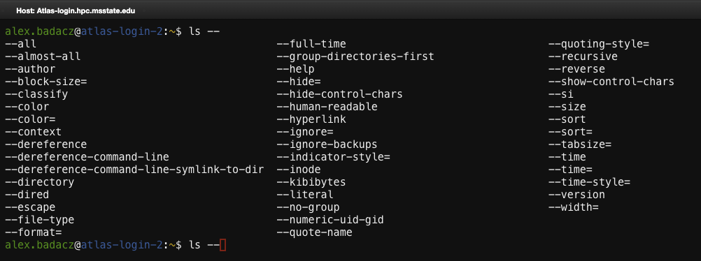
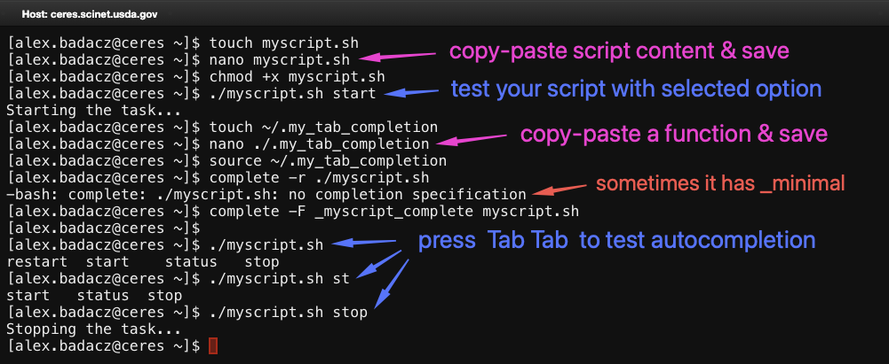

---

title: Command autocompletion
description: "A shell feature that predicts and completes commands, filenames and options based on partial input from a user."
type: interactive tutorial
order: 2
tags: 
packages: 
level: 
author: Aleksandra Badaczewska

---

# Overview

This interactive tutorial focuses on command autocompletion, a powerful shell feature that enhances efficiency by predicting and completing command names *(built-in, aliases, function names, binaries on $PATH)*, filenames and arguments. By learning how to use `Tab`-based autocompletion, you can minimize typing errors and navigate the command line more effectively. This tutorial provides hands-on exercises for mastering autocompletion in Bash (Unix shell), particularly within SCINet HPC clusters.
<br>

<div id="info-alerts-1" class="highlighted highlighted--info ">
<div class="highlighted__body"  markdown="1">
<h4 class="highlighted__heading">Main Objectives</h4>
* Learn how `Tab` completion works for commands, filenames and arguments in the shell.
* Understand how Bash autocompletion improves command-line efficiency.
* Explore advanced autocompletion features for handling command options and custom scripts.
</div>
</div>

<div id="success-alerts-1" class="highlighted highlighted--success ">
<div class="highlighted__body"  markdown="1">
<h4 class="highlighted__heading">Goals</h4>
<p>By the end of this tutorial, you will:</p>
* Efficiently use `Tab`-based autocompletion to reduce typing errors and speed up command entry.
* Navigate file paths and directories using intelligent autocompletion.
* Learn how to enable and extend Bash autocompletion for additional commands.
</div>
</div>


### Tutorial scope

This tutorial provides a practical, hands-on guide to command autocompletion, covering both built-in features and custom enhancements. 
It focuses on real-world applications in HPC environments, where fast and error-free command entry is essential. 
You will explore default shell completion, how to enable advanced features and how to troubleshoot autocompletion issues.

<div class="usa-accordion">


<div id="scope-concepts" class="accordion_content" markdown="1">
* **Command autocompletion:** A shell feature that suggests and completes commands, filenames, and arguments.
* **Tab completion:**  Pressing the `Tab` key to complete partially typed commands or file paths.
* **Bash completion:** An extended autocompletion framework that enables smart suggestions for various commands.
* **Custom autocompletion:** Defining personalized completion rules for scripts, aliases and custom commands.
</div>

 
<div id="scope-tools" class="accordion_content" markdown="1">
* **Bash shell:** A popular shell environment (command interpreter) available on most Unix-like and HPC systems.
* **Tab key (`⇥`):** The primary input method for triggering shell autocompletion.
* **`bash-completion` package:** A tool that extends default Bash autocompletion capabilities.
* **Shell configuration files (`.bashrc`):** Shell startup script used to enable and customize autocompletion behavior.
</div>

 
<div id="scope-apps" class="accordion_content" markdown="1"> 
* **Faster command execution:** Use autocompletion to quickly recall commands, files and paths.
* **Error reduction:** Minimize typos and incorrect paths by letting the shell autocomplete inputs.
* **Navigating directories efficiently:** Autocomplete long or complex file paths without excessive typing.
</div>
</div>

---

## What is command autocompletion?

Command autocompletion is a shell feature that helps users predict and complete commands, filenames, directories, tool names and options *(in some cases)*. 
Instead of typing long commands / program names or remembering complex file paths, you can simply press `Tab` to let the shell complete the input for you.


#### How Does It Work?

1. The shell looks at what you've typed so far.
2. It searches for possible completions based on context.
* If a unique match exists, it completes automatically.
* If multiple matches exist, press `Tab` the second time and suggestions will be displayed to choose from.

### Basic `Tab` completion

Type the beginning of a command and press `Tab` to autocomplete matching command:
```bash
ca<Tab>   →   cat
```

Then, you can simply autocomplete filenames in the current directory:
```bash
cat fil<Tab>   →   cat file.txt
```

It also works with relative and absolute paths:
```bash
cd /home/user/D<Tab>   →   cd /home/user/Documents
```


### Handling multiple matches `TabTab`

If multiple matches exist, **press** `Tab` **twice** to list possibilities:
```bash
cd D<Tab><Tab>
# Desktop/  Documents/  Downloads/
```
Use more characters *(e.g., `Do`, `Dow`)* to indicate your selection and press `Tab` again for autocompletion.


### Complete tool names from $PATH

Bash searches for commands (executable tools) in directories listed in `$PATH`:
```bash
echo $PATH
```
If a binary of a desired tool is in $PATH, pressing `Tab` completes it:
```bash
pyt<Tab>  →  python3
```

<div id="info-alerts-1" class="highlighted highlighted--highlighted ">
<div class="highlighted__body"  markdown="1">
To make a **custom-installed tool available in the command line by its name**, you must ensure its directory is included in the `$PATH` [environment variable](/computing-skills/command-line/cli-interface/shell/variables). 
So, if the tool is installed in a custom location (e.g., `~/software/`), it won't be recognized unless its path is added to `$PATH`. You can do this by adding the following line to your `~/.bashrc`:
```bash
export PATH="$HOME/software:$PATH"
```
*(Reference tutorial: [Shell configuration files (startup scripts): .bashrc  →  Modifying $PATH for local binaries](/computing-skills/command-line/cli-interface/shell/customization/bashrc#modifying-path-for-local-binaries))*
</div></div>


### *Display all commands in a shell*

<div id="info-alerts-1" class="highlighted highlighted--tip ">
<div class="highlighted__body"  markdown="1">
Using `Tab` autocompletion is a great way to explore all available text-based instructions in your shell, including built-in commands, aliases, functions and executables in $PATH.
Simply type a letter *(e.g., "z")* and press `Tab` twice to **list all callable instructions that start with that letter**. 


*This helps you quickly discover what’s available in your environment!*
</div></div>


### Complete command options

<div id="info-alerts-1" class="highlighted highlighted--highlighted ">
<div class="highlighted__body"  markdown="1">
Bash's built-in tab completion does not automatically suggest flags or options (like `--all`, `--help`) unless **bash-completion** is installed. 
This advanced flag/option completion for commands like `ls`, `tar`, `git`, etc., is **enabled by default on Atlas** but not on Ceres cluster. <br>
* You can check if `bash-completion` is installed by running:*
```bash
type _init_completion
```
</div></div>

When bash-completion is enabled, many commands support autocompletion for flags and options. <br>
*Try this feature by typing `ls --` and pres `Tab` twice:*
```bash
ls --<Tab><Tab>  
```


*If you know the beginning of the option name, type one letter or more to narrow down the match. Pres `Tab` twice:*
```bash
ls --h<Tab><Tab>  
```


<div id="info-alerts-1" class="highlighted highlighted--tip ">
<div class="highlighted__body"  markdown="1">
To preview available options for commands on Ceres, use the `--help` flag with a command <br>(e.g., `ls --help`). Select an option and type it manually with a command.
</div></div>

#### Completing options works for some external tools

Some external tools support their options and subcommands to be completed with the `Tab` key. 
This works because they have **predefined completion scripts** integrated into Bash (usually provided by the `bash-completion` package).

*For example, when using `git`:*
```bash
git chec<Tab>   →   checkout   # unique match completed with single Tab
git st<Tab><Tab>  →   stage    stash    status      # list of matches displayed with Tab pressed twice
```


Besides `git`, many CLI-based tools support option autocompletion, including `ssh`, `module`, `awk`.


## Autocompletion for your own scripts

Autocompletion is a powerful feature that speeds up command-line usage by suggesting possible completions for commands, filenames, paths and options. 
You can also define custom autocompletion for your own scripts. This is particularly useful when working with frequently used scripts that accept specific arguments. 
It will also remind you of valid options before running the script in the distant future.

<div id="info-alerts-1" class="highlighted highlighted--success ">
<div class="highlighted__body"  markdown="1">
By defining custom autocompletions, you can significantly improve the efficiency of working with your scripts on SCINet HPC system! 
The approaches presented in this section work consistently on both Atlas and Ceres clusters, as they rely on built-in Bash features and standard environment configurations.
</div></div>

### Write a custom completion function

<div id="info-alerts-1" class="highlighted highlighted--note ">
<div class="highlighted__body"  markdown="1">
Bash allows you to create autocompletion functions that suggest options for your scripts. <br>
This is possible by leveraging a few built-in commands in a Bash shell:
* `compgen` to generate possible completions, 
* `complete` to assign them to a command, and 
* `compopt` to fine-tune behavior, 

to make the command line more efficient and user-friendly. 
Together, they help create custom autocompletion logic, which gets triggered when pressing `Tab` while calling a script.
<br><br>
These commands work natively in Bash, but their functionality can be extended with the **bash-completion** package 
*(not covered in this tutorial)*, which adds predefined completions for many tools.
</div></div>

#### Hands-on example

Suppose you have a script named `myscript.sh`, which accepts specific arguments such as `start`, `stop`, `restart` and `status`. 
You can create a **custom completion function** to suggest these options when pressing `Tab`.

**0. Here is an example script.** *(You can copy-paste it to the `myscript.sh` file.)*
```bash
#!/bin/bash

[[ $# -eq 0 ]] && { echo "Usage: $0 {start|stop|restart|status}"; exit 1; }

case "$1" in
    start) echo "Starting the task...";;
    stop) echo "Stopping the task...";;
    restart) echo "Restarting the task...";;
    status) echo "Checking status of the task...";;
    *) echo "Invalid option: $1"; exit 1;;
esac
```
*Make it executable, and test with a `start` option:*
```bash
chmod +x myscript.sh
./myscript.sh start         # expected output: Starting the task...
```


**1. Create an autocompletion function** <br>
Define a function in a dedicated sourced script, e.g., `~/.my_tab_completion`, that provides the completion behavior:
```bash
_myscript_complete() {
    local cur prev opts
    COMPREPLY=()
    cur="${COMP_WORDS[COMP_CWORD]}"         # stores the current word being typed
    prev="${COMP_WORDS[COMP_CWORD-1]}"
    opts="start stop restart status"

    COMPREPLY=( $(compgen -W "$opts" -- "$cur") )    # generates completions based on predefined options
    return 0
}
```
Then, source the configuration file:
```
source ~/.my_tab_completion
```

**2. Register the completion function** <br>
To activate this autocompletion for `myscript.sh`, link the function to the script using `complete` command:
```bash
complete -r ./myscript.sh     # clears any existing completion (like _minimal) before applying your custom one              
complete -F _myscript_complete myscript.sh    # register custom completion
```
*This tells Bash to call `_myscript_complete` function whenever you type `./myscript.sh` and press `Tab`.*

**3. Test the Autocompletion** <br>
After defining the function and registering it, test the autocompletion:
```bash
./myscript.sh <Tab><Tab>         # expected output: start  stop  restart  status
```
*If everything is set up correctly, `Tab` should suggest pre-defined options.*



**4. Persist the setup for all future shells** <br>
To keep autocompletion active in future sessions, add these lines to your `~/.bashrc`:
```bash
# Custom autocompletion using Tab
source ~/.my_tab_completion
complete -r ./myscript.sh       # provide an absolute path to your custom script
complete -F _myscript_complete ./myscript.sh    # same here
```
*`source ~/.bashrc` to apply changes in a current shell.*


### Define an alias to preview options

Alternatively, you can use a simple alias combined with `complete -W` to display predefined options for a custom script. 
This can be useful for quickly recalling frequently used settings without needing to remember them each time.
* Reminds you of valid options before running the script.
* Speeds up command entry with autocompletion.
* Ensures consistency, preventing forgotten arguments.

#### OPTION 1: Define an alias returning options

If your script is named `myscript.sh` *(see [example in section above](#write-a-custom-completion-function))*, create an alias to quickly recall common options:
```bash
alias myscript_opts='echo "start stop restart status"'
```
Now, running `myscript_opts` will print: *start stop restart status*.


*This is useful for quickly listing valid options before running the actual command. It requires that you manually create an alias with available options (once).*

<div id="info-alerts-1" class="highlighted highlighted--tip ">
<div class="highlighted__body"  markdown="1">
Creating an alias for a script with predefined options is not just about convenience, it also helps preserve analysis settings and ensures consistent execution over time.

*Following our example, if a project required frequent status checks in the analysis, we could create an alias to always run a script in the correct configuration:*
```bash
alias myscript_status='./myscript.sh status'    # simple example
```
This approach is even more useful for scripts that require multiple parameters. Suppose you have an analysis script that takes specific arguments:
```bash
alias analysis_for_projectX='./analysis_script.sh --mode strict --threshold 0.05'    # more advanced settings, specific to a project 
```
*This ensures repeatability in your workflow, helps retain the exact settings used in past analyses, and prevents errors when revisiting a project after a long time.*
</div></div>

#### OPTION 2: Define an alias filtering options with `Tab`

To allow `Tab` autocompletion for an alias storing the options:
```bash
complete -W "start stop restart status" myscript
```
Now, typing `myscript` and pressing `Tab` twice, you will see all options suggested: *start stop restart status*. 
You can always narrow down options using the filtering based on matched pattern.


<div id="info-alerts-1" class="highlighted highlighted--warning ">
<div class="highlighted__body"  markdown="1">
This alias does not execute the actual script. It only provides informational autocompletion, meaning you can see and filter options with `Tab`. 
To execute the script with the selected option, use the correct script name (e.g., `./myscript.sh start`).
</div></div>